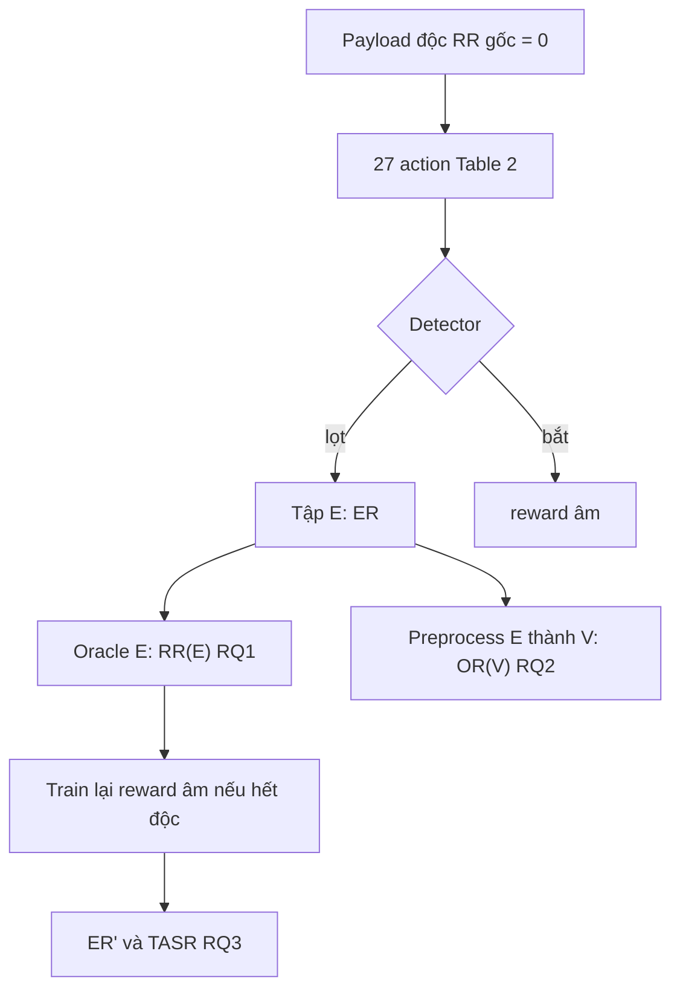

# P6 — Các chương luận văn (Related Work, Phương pháp, Kết quả, Thảo luận)

Ngày: 2026-09-17  
**Cách dùng:** copy từng mục vào Word/LaTeX nhà trường. Số đã chốt; không bịa thêm.  
Khung + W1–W10: `PLAN_LAM_THEO_PASINI.md`. Sổ tay: `HUONG_DAN_CHI_TIET.md`.

Phạm vi: localhost, dataset Mereani / artifact Pasini `data/10`, CRS 4 lab, không WAF cloud, không LLM generator.  
Bám PDF v2: Pasini et al., JSS 2026, arXiv:2502.19095v2 (RQ1–RQ3). Không dùng đánh số RQ1–RQ4 của bản HTML cũ.

**Một câu:** Chen báo Escape Rate ~99% mà không kiểm tra payload còn là XSS. Pasini thêm Oracle DOM và chỉ ra preprocess/OOV. Luận văn bám khung (Oracle → Ruin Rate → Oracle-in-the-loop), siết Oracle thành thực thi JavaScript, và đo thêm CRS/DOMPurify bằng TASR.

---

## 0. Evidence → Finding → Path

| ID | Evidence | Finding | Path |
|---|---|---|---|
| E1 | `lab/data/filter_report.json`: 3542/15149 (23.4%) nhãn Malicious Mereani chỉ đổi DOM, không execute JSDOM | Oracle BeautifulSoup+zss của Pasini **không** tương đương XSS | Lọc lab bằng oracle thực thi; RR gốc = 0 trên 10824 mẫu |
| E2 | Artifact `mutators.py` @ a299bb6: A18 `return payload`, A20 stub, A21 `alert(1)` → `(1)(1)` | Table 2 paper ≠ code | Lab viết lại 27 action; không import `mutators.py` vào train luận văn |
| E3 | Artifact `XSSDataset`: `LabelEncoder.fit_transform` từng payload; Table 4 lab trùng P/R/Acc/F1 = 99.67/100/99.83 | Ba mạng một bộ số; token-id không ổn định | Nhánh A giữ bug để tái lập ER ~99%; nhánh B khép encode |
| E4 | Nhánh A `data/10`: LSTM ER 98.78%, RR(V) 98.54%, OR(V) 48.5% | Tái lập RQ replication + TH2 trên đúng split Pasini | Viết “protocol lặp lại được”, không “reproduced Chen 99%” |
| E5 | Nhánh A RQ3 LSTM+Oracle: ER 98.34%, RR(E)=RR(V)=0, OR(V) 1.69% | Claim Pasini RQ3 lặp lại được **với Oracle DOM** | Không đồng nhất với XSS còn chạy JS |
| E6 | Nhánh B P3: LSTM acc 0.991, PPO 3×20k ER tb 0.75%; escape còn lại OR(V) 0.28–0.75 | Khi khép OOV, ER 99% biến mất; TH2 còn nhưng hiếm | Không viết replication ER 99% trên lab JSDOM |
| E7 | Nhánh B P4: PPO ER=TASR=0.25%; Dueling DQN 1.08%; RR=0 | Oracle execute kéo ER về sàn FN | Bảng PPO vs DDQN; không khoe thuật toán |
| E8 | P5 CRS PL1: 84+672+686+1120+60 Table 2/mở rộng = 0 BYPASS_EXEC; DOMPurify Δ=1 | WAF không dính `None`; lọt HTTP ≠ còn độc | TASR bắt buộc; không train RL trên CRS |

---

## 1. Cơ sở lý thuyết và công trình liên quan

### 1.1 XSS và phát hiện bằng học sâu

Cross-site scripting (XSS) chèn mã vào trang web để trình duyệt nạn nhân thực thi. Phát hiện XSS bằng đặc trưng thủ công rồi học máy (Mereani và Howe, 2018) được thay dần bằng mạng sâu: Fang et al. (DeepXSS, 2018) dùng Word2Vec+LSTM; Mokbal et al. (2019), Tekerek (2021) báo cáo độ chính xác >97% trên tập công khai. Detector học sâu vẫn dính tấn công đối kháng vì ánh xạ payload → vector rời rạc.

### 1.2 Tấn công đối kháng XSS bằng RL

Fang et al. (2018) dùng Dueling DQN, Escape Rate dưới 10%. Zhang et al. (2020) dùng MCTS, chiến lược thoát hạn chế, chi phí cao. Wang et al. (2022) soft Q-learning, ER khoảng 85%. Chen et al. (2022) dùng SAC, 27 đột biến (Table 2), preprocess giữ 10% token phổ biến, ER >90% trên MLP/LSTM/CNN và công cụ thương mại. Dataset ~90k của Chen **không công khai** (mối đe dọa TH3 của Pasini).

### 1.3 Pasini et al. (2026) — khung đánh giá

Pasini, Maragliano, Kim, Tonella (JSS 2026) tái lập Chen trên Mereani, PPO thay SAC (SB3 SAC chỉ continuous), sigmoid thay softmax, Oracle FastAPI+Jinja `|safe` + BeautifulSoup + `zss` so với payload `"abc"`. Ba RQ (PDF v2):

- **RQ1 / TH1:** đột biến có phá XSS không? `RR(E)` trên tập lọt detector.
- **RQ2 / TH2:** preprocess/OOV có phá XSS không? `RR(V)`, `OR(V)`.
- **RQ3:** nhét Oracle vào reward thì ER còn cao không?

Họ kết luận TH1 nhẹ (~6–7%), TH2 là thủ phạm (`RR(V)` ~93–98%, `OR(V)` ~44–47%). Khi Oracle vào train, ER vẫn >96% và `RR(V)` ~0.

Luận văn **không invent generator mới**. Đóng góp: (i) tái lập đúng artifact/`data/10`; (ii) siết Oracle thành thực thi JS; (iii) đo CRS 4 + DOMPurify bằng TASR.

### 1.4 Công thức

\[
ER = \frac{\#\text{ độc mà detector gọi lành}}{\#\text{ adversarial}}
\]

\[
O(p)=1 \text{ nếu Oracle = Malicious},\quad
RR(M)=1-\frac{1}{|M|}\sum_{m\in M}O(m)
\]

\[
OR(V)=\frac{\#\text{ token }None}{|V|}
\]

Lab CRS:

- Escape = tỉ lệ HTTP 200 (phụ)
- **TASR** = `#BYPASS_EXEC / N` (chính; ER có oracle thực thi)
- **Δ** = Escape − TASR

Ba nhãn: `BLOCK` | `BYPASS_NOEXEC` | `BYPASS_EXEC`. Chỉ TASR được viết là tấn công thành công.

---

## 2. Phương pháp

### 2.1 Hai nhánh thí nghiệm (không trộn số)



| Nhánh | Dataset | Encode token | Oracle | Mục tiêu |
|---|---|---|---|---|
| **A — sát Pasini** | Artifact `data/10` (Table 3) | `LabelEncoder.fit_transform` từng mẫu như artifact | DOM-diff vs `"abc"` | Tái lập ER ~99% và RQ3 |
| **B — luận văn** | Mereani lọc JSDOM, split kiểu Table 3 | id **cố định** theo vocab | JSDOM hook + Playwright hold-out | Khép TH2; đo TASR trên CRS |

Cùng 27 mô tả Table 2. Nhánh A dùng `mutators.py` (kể cả A18 no-op, A21 `(1)(1)`). Nhánh B dùng `lab/src/actions.py` (A18/A20/A21 làm đúng).

### 2.2 Khác biệt Chen / Pasini / luận văn

| Hạng mục | Chen 2022 | Pasini 2026 | Luận văn |
|---|---|---|---|
| Dataset detector | XSSed+Alexa ~90k, không public | Mereani + Oracle DOM, undersample | Tập A: Mereani JSDOM; nhánh A: đúng `data/10` |
| Detector | MLP LSTM CNN + SafeDog/XSSChop | MLP LSTM CNN | Nhánh A: đủ 3 mạng. Nhánh B: LSTM + **CRS PL1/PL2 + DOMPurify** |
| Agent | SAC | PPO SB3 | PPO (replication) **và** Dueling DQN — bảng `lab/data/PPO_VS_DDQN.md` |
| State | lịch sử action | lịch sử action (code) | **Giữ lịch sử action** như paper (chưa nhúng payload) |
| Reward | +10 / −1 | PDF −2 nếu vỡ; **code −5** | Nhánh A: đúng code −5. Nhánh B: `R_exec` (−2 hết độc; +10 chỉ khi lọt **và** execute) |
| Oracle | không | BS4 + zss | Nhánh A: như paper. Nhánh B: JSDOM; Playwright 4 seed |
| Metric chính | ER | ER + RR + OR | Nhánh A: ER/RR/OR. Nhánh B: **TASR + Δ** |
| Action | 27 mô tả | 27, A18/A20/A21 lỗi | Nhánh B đủ 27 + `parser_alive` / `browser_alive` |

Lệch protocol nhánh B đã ghi: Adam (SGD kẹt 50% trên split JSDOM); pad 40 (trung vị token = 6; code artifact `MAX_LENGTH=30`, paper viết 200); 3 seed PPO (paper 10); eval agent 400/1084.

Nhánh A lệch môi trường, không đổi protocol: `int(embedding_dim)` (PyTorch 2.14); `TemplateResponse` Starlette 1.x.

### 2.3 Oracle

**Pasini (nhánh A).** FastAPI nhét payload vào Jinja `|safe`. DummyDetector luôn True. `O(p)=1` khi cây DOM khác trang `"abc"`. Hệ quả: `<div>hello</div>` = Malicious. Paper mục 8 tự nhận Oracle “may be subject to misclassification”.

**Luận văn (nhánh B).** JSDOM `runScripts: dangerously`, hook `alert`/`confirm`/`prompt`/`print`/`eval`/`Function`/`document.title`/`cookie`/`__XSS_ORACLE`. `parser_changed` chỉ tín hiệu phụ. Playwright Chromium hold-out trên 4 seed; không dùng để train.

### 2.4 Dataset và split

Mereani `Payloads.csv` (latin-1): 43217 dòng, 15149 độc / 28068 lành.

Nhánh A: dùng nguyên `filtered_oracle.csv` → `data/10` của artifact. Detector train/val/test 2883+721+901 mỗi lớp (Benign detector 2883/721/901). Agent chỉ Malicious 2883/721/901. Vocab 720 token (10%).

Nhánh B: lọc JSDOM. Giữ 10824 độc execute, loại 3542 parser-only (W1 = 23.4%), loại 783 không DOM không JS, loại 10 lành false-positive oracle. RR trên tập giữ = 0. Split seed 42, tỉ lệ Table 3: detector 3463/865/1084 mỗi lớp; agent 3463/865/1084 chỉ độc.

### 2.5 Detector và agent

Nhánh A: MLP/LSTM/CNN artifact, embed 8, SGD 1e−3, batch 16, 150 epoch, patience 10, BCE+sigmoid. PPO `MlpPolicy`, 250000 timesteps, max 15 bước, 27 action, eval 721 episode mỗi 25k bước.

Nhánh B: LSTM embed 8, hidden 128, vocab 1191, pad 40, Adam 1e−3. PPO 20k × 3 seed (thêm 80k một seed). P4: PPO 3 seed + DQN SB3 1 seed + Dueling DQN 3 seed, `R_exec`.

### 2.6 P5 — CRS và DOMPurify

`payload → CRS PL1 (:18080) / PL2 (:18081) → (tuỳ chọn) DOMPurify trên app :13000 → Oracle execute`.

Paranoia CRS 1 và 2, anomaly inbound 5. Chỉ 127.0.0.1. Không claim WAF cloud.

Gate trước khi train RL trên CRS: tồn tại ≥1 payload Table 2 vừa execute vừa HTTP 200 trên PL1. **Không đạt** → không train RL trên CRS, không LLM payload.

---

## 3. Kết quả

### 3.1 P1 — Oracle thực thi và Mereani (nhánh B)

| | n |
|---|---:|
| Mereani gốc | 43217 (15149 độc / 28068 lành) |
| Độc còn execute, giữ | **10824** |
| Độc chỉ đổi DOM, loại (W1) | **3542 (23.4%)** |
| Độc không DOM không JS | 783 |
| Lành bị oracle gọi độc | 10 |
| RR trên tập độc đã giữ | **0.0** |

Pasini giữ 3542 mẫu parser-only. Lab loại. Đó là đo W1 trên đúng nguồn Mereani.

### 3.2 P2 — 27 action

Khi action thật sự đổi payload (3 seed: `<script>alert(1)</script>`, ``, `javascript:` href):

- Giữ execution: A1 A2 A3 A4 A8 A11 A14 A15 A17 A18 A19 A21 A22 A23 A27.
- Parser sống, JS chết (W8): A5 A6 A7 A12 A13 A20 A25. A9/A24/A26 chết một phần seed.
- A10/A16 no-op trên 3 seed không có `http://` / `data:` — bình thường.
- Lab: A18 không no-op; A21 không `(1)(1)`.

### 3.3 Nhánh A — tái lập sát artifact (`data/10`, seed 42)

**Table 4 detector.** Test n=1802. Cả ba mạng: TP=901, FP=3, TN=898, FN=0.

| | Precision | Recall | Accuracy | F1 |
|---|---:|---:|---:|---:|
| Paper MLP = LSTM = CNN | 99.67% | 100% | 99.83% | 99.83% |
| Lab LSTM / MLP / CNN | **99.67%** | **100%** | **99.83%** | **99.83%** |

Trùng tới hai chữ số. Ba mạng một bộ số = W4 đo được, không phải copy bảng.

**PPO không Oracle, 250k bước, test 901.**

| | ER paper (10 seed) | ER lab | RR(E) paper | RR(E) lab | RR(V) paper | RR(V) lab | OR(V) paper | OR(V) lab |
|---|---:|---:|---:|---:|---:|---:|---:|---:|
| LSTM | 98.62% | **98.78%** (890/901) | 6.34% | **8.99%** | 97.31% | **98.54%** | 47.49% | **48.54%** |
| MLP | 99.73% | **98.67%** | 7.07% | **10.24%** | 97.84% | **98.54%** | 44.76% | **45.01%** |
| CNN | 98.25% | **98.89%** | 6.36% | **0%** | 92.57% | **1.35%** | 43.85% | **2.42%** |

LSTM/MLP khớp TH2 (OOV cao). CNN seed 42 vẫn ER ~99% nhưng ít `None` (spam `<script>`, LabelEncoder vẫn lệch id) — phương sai 1 seed, không fail ER.

Val LSTM: reward −8.57 @ 25k → ~5.8 từ 50k đến 250k. Entropy 3.29 → 0.16.

LSTM PPO không Oracle thêm seed 43/44 (50k): ER 97.34% / 96.56%. Tb 3 seed **97.56%** vs paper 98.62%.

**RQ3 Oracle-in-loop (code −5), test 901.**

| | ER paper | ER lab | RR(V) lab |
|---|---:|---:|---:|
| LSTM 250k seed 42 | 98.13% | **98.34%** | **0** |
| CNN 250k seed 42 | 96.89% | **96.00%** | **0.12%** |
| MLP 250k seed 42 | 97.37% | **97.89%** | **0** |

CNN 50k đã ER 96.00%; bản 250k (`run_1`) cùng 865/901, RR(V)=0.12% — hội tụ từ 50k, khác MLP (50k chỉ 83.8%).

Câu được: *Trên đúng artifact và split `data/10`, tái lập ER ~99% (replication), RR(V)~98% (TH2), và RQ3 LSTM/CNN ER>96% với RR≈0 theo Oracle DOM.*

Câu cấm: coi ER 99% sau Oracle DOM là XSS còn chạy JavaScript.

### 3.4 Nhánh B P3 — LSTM + PPO, encode ổn định

LSTM test n=2168: acc **0.991**, P 0.990, R 0.992, F1 0.991. FN không đột biến 400 mẫu: **0.25%**.

| Seed | Bước | Escape | ER | RR(E) | OR(V) trên E |
|---:|---:|---:|---:|---:|---:|
| 42 | 20k | 1 | 0.25% | 0 | 0.75 |
| 43 | 20k | 2 | 0.50% | 0 | 0.28 |
| 44 | 20k | 6 | 1.50% | 0.33 | 0.40 |
| 45 | 80k | 8 | 2.00% | 0.12 | 0.43 |

ER tb 3 seed × 20k = **0.75%**. 80k → 2%. Pasini artifact >96%.

Khi khép token-id và action giữ XSS, PPO Table 2 không còn ER ~99%. Escape còn lại mang OOV cao — TH2 vẫn tồn tại nhưng hiếm.

### 3.5 Nhánh B P4 — Oracle-in-loop và bảng PPO vs DDQN

Chi tiết: `lab/data/PPO_VS_DDQN.md`.

| Agent | Oracle train | ER | TASR | RR(E) |
|---|---|---:|---:|---:|
| P3 PPO, 3 seed | không | **0.75%** | ~0.58% | 0–0.33 |
| P4 PPO + `R_exec`, 3 seed | có | **0.25%** | **0.25%** | **0** |
| P4 DQN SB3, seed 42 | có | 0.25% | 0.25% | 0 |
| P4 Dueling DQN, 3 seed | có | **1.08%** | **1.08%** | **0** |
| Sàn FN | — | 0.25% | 0.25% | 0 |

Dueling DQN từng seed: 1.75% / 0.75% / 0.75%. Wilcoxon P3 vs P4 PPO: n=2, p=0.5 — chỉ mô tả, P4 ≤ P3 mọi seed.

Trên LSTM đã khép OOV, `R_exec` kéo ER về sàn FN. Không tái lập RQ3 ER>96% của Pasini **khi Oracle là thực thi JS**.

### 3.6 Đối chiếu hai nhánh (cùng protocol, khác encode)

| | Nhánh A `data/10` + LabelEncoder | Nhánh B JSDOM + id cố định |
|---|---|---|
| LSTM acc | 99.83% | 99.1% |
| PPO không Oracle ER | **98.78%** | **0.75%** |
| PPO + Oracle ER | **98.34%** | **0.25%** |
| RR(V) không Oracle | 98.54% | ít escape; OR trên E 28–75% |
| RR sau Oracle-in-loop | 0 (Oracle DOM) | 0 (Oracle JS) |

ER 99% là artifact encode/OOV, không phải tấn công XSS ổn định.

### 3.7 P5 — CRS, DOMPurify, transfer, Playwright

| Thí nghiệm | n | TASR CRS PL1 |
|---|---:|---|
| 3 seed × 27 action `/html` | 84 | **0** |
| Cặp 2 action | 672 | **0** |
| Bộ ba keeper | 686 | **0** |
| Mereani decode × Table 2 | 1120 | **0** |
| Transfer PPO P3/P4 (80) | 80 | **0** |
| TAP-B + E1–E10 | 60 | **0** |

Cùng 84 payload `/html`: App không WAF TASR **0.845**, Δ=0.155. DOMPurify TASR **0**, Δ=**1.00** (lọt HTTP, hết độc).

Transfer LSTM-agent → CRS: PL1/PL2 TASR=0. App TASR P4 = 0.0125 vì Mereani nhiều URL, khác seed `<script>`.

Playwright: `<script>alert(1)`, ``, `javascript:` href execute; `<div>hello</div>` không — khớp JSDOM trên seed. Không có mẫu Chromium-qua-WAF.

Gate `BYPASS_EXEC` PL1 **không đạt**. Không train RL trên CRS.

Câu được: *Trên lab CRS 4 paranoia 1, catalog Chen/Pasini và PPO train LSTM có TASR=0. WAF không dính OOV-None.*

---

## 4. Thảo luận

Pasini sửa Chen đúng hướng: phải đo payload còn độc. Oracle DOM của họ vẫn gọi HTML injection là XSS (E1). `RR(V)` trên chuỗi đã thay `None` gần tautology (W2). Nhánh A chứng minh: giữ nguyên bug encode thì số paper lặp lại được. Nhánh B chứng minh: khép bug thì ER sụp. CRS chứng minh: detector không dính `None` thì Table 2 không tạo BYPASS_EXEC.

Đóng góp so paper: oracle thực thi; catalog 27 action làm đủ; TASR/Δ trên CRS+DOMPurify; bảng PPO vs Dueling DQN trên detector đã khép OOV.

Không đóng góp: generator XSS mới; bypass CRS; đánh WAF cloud.

---

## 5. Hạn chế (threats to validity)

- JSDOM ≠ mọi XSS (mXSS, DOM clobbering, sink framework). Playwright chỉ 4 seed.
- Mereani 2018: `alert` / `<script>`; TAP-B không làm LSTM vỡ (FN=0 trên 17 mẫu chạy).
- Table 2 lỗi thời (`vbscript`, `%00`). A10/A16 no-op trên seed không URL.
- Nhánh A: 1 seed (paper 10). CNN RR(V) lệch trung bình paper.
- Nhánh B: 3 seed, eval 400, pad 40, Adam. Wilcoxon n=2 vô nghĩa thống kê.
- State MDP chưa nhúng payload (giữ như paper).
- Histogram action P4: một escape = sàn FN, không kết luận policy dùng A1/A6–A13.
- CRS paranoia 1–2 lab, không phải rule set production hay WAF nhà cung cấp.

---

## 6. Kết luận

1. Khung Pasini (Oracle → RR → Oracle-in-loop) là đúng chỗ bám.
2. Trên đúng `data/10` và code artifact, ER ~99% và RQ3 ER ~98% **tái lập được**.
3. Thủ phạm là token-id không ổn định + OOV `None` (TH2), không phải “RL sinh XSS mạnh”.
4. Khi encode ổn định và Oracle là thực thi JS, PPO/DDQN Table 2 về sàn FN (~0.25–1.08%), RR=0.
5. CRS/DOMPurify: TASR=0 trên catalog Chen/Pasini; Δ Purify = 1. Không train RL khi chưa có primitive BYPASS_EXEC.

---

## 7. Câu được viết / câu cấm

**Được**

- Khung đánh giá theo Pasini et al. (2026): mẫu đối kháng phải còn độc theo oracle thực thi.
- 23.4% nhãn Malicious Mereani chỉ đổi DOM — Oracle BeautifulSoup không tương đương XSS.
- Trên artifact `data/10`, PPO tái lập ER ~99% và RQ3 ER 98.3% với RR=0 theo Oracle DOM.
- Khi khép token-id, PPO Table 2 không còn ER ~99%; escape còn lại mang OOV cao.
- Trên LSTM đã khép OOV, PPO ER=TASR=0.25%, Dueling DQN 1.08%, RR(E)=0.
- Trên lab CRS 4 PL1, catalog Chen/Pasini có TASR=0.

**Cấm**

- Replication thành công ER Chen 99% như thành công của luận văn.
- “Reproduced Chen’s numbers”; replication SAC.
- PPO/DQN mạnh hơn Chen.
- Bypass CRS; đánh AWS WAF / WAF cloud.
- CRS 200 = TASR; dùng LLM sinh payload.
- Wilcoxon p=0.5 như khác biệt có ý nghĩa.
- RQ1–RQ4 theo HTML cũ thay PDF v2.

---

## 8. Tài liệu tham khảo

Pasini, S., Maragliano, G., Kim, J., Tonella, P. (2026). Cross-site scripting adversarial attacks based on deep reinforcement learning: Evaluation and extension study. *Journal of Systems and Software*. DOI: 10.1016/j.jss.2026.112856. arXiv:2502.19095.

Chen, L., Tang, C., He, J., Zhao, H., Lan, X., Li, T. (2022). XSS adversarial example attacks based on deep reinforcement learning. *Computers & Security* 120:102831.

Mereani, F.A., Howe, J.M. (2018). Detecting cross-site scripting attacks using machine learning. *AMLTA 2018*.

Fang, Y., Li, Y., Liu, L., Huang, C. (2018). DeepXSS: Cross site scripting detection based on deep learning. (DeepXSS / DDQN, ER < 10%).

Wang, Y. et al. (2022). Soft Q-learning XSS adversarial examples. *Computers & Security* 113:102554. ER ~85%.

Zhang et al. (2020). MCTS for XSS adversarial examples. *IEEE Access*.

Schulman, J. et al. (2017). Proximal Policy Optimization Algorithms. arXiv:1707.06347.

Haarnoja, T. et al. (2018). Soft Actor-Critic. arXiv:1801.01290.

OWASP ModSecurity Core Rule Set (CRS) 4. Lab paranoia 1–2, không phải đánh giá nhà cung cấp WAF.

Cure53 DOMPurify. Đo Δ = Escape − TASR trên app lab.

---

## 9. File số và lệnh

| Nội dung | File |
|---|---|
| Replication `data/10` | `lab/data/PASINI_FAITHFUL_RESULTS.md` |
| P1 P2 | `lab/data/P1_P2_RESULTS.md` |
| P3 | `lab/data/P3_RESULTS.md` |
| P4 | `lab/data/P4_RESULTS.md` |
| PPO vs DDQN | `lab/data/PPO_VS_DDQN.md` |
| P5 | `lab/data/P5_RESULTS.md` |
| Checkpoint nhánh A | `artifact/Adversarial_RL_XSS/runs/{lstm,mlp,cnn}/10/run_0/` |
| Checkpoint nhánh B | `lab/runs/p3/`, `lab/runs/p4/` |

```bash
# Nhánh B
cd lab
../.venv/bin/python -m unittest tests.test_oracle tests.test_actions -v
../.venv/bin/python src/run_p3.py --phase eval --ppo-seeds 42,43,44 --max-eval 400
../.venv/bin/python src/run_p4.py --phase eval --algo ppo,dqn --seeds 42,43,44 --max-eval 400
../.venv/bin/python src/measure_tasr.py --sink /html

# Nhánh A (đã chạy; lần sau dùng fast)
bash lab/src/run_pasini_faithful.sh eval-lstm
```
